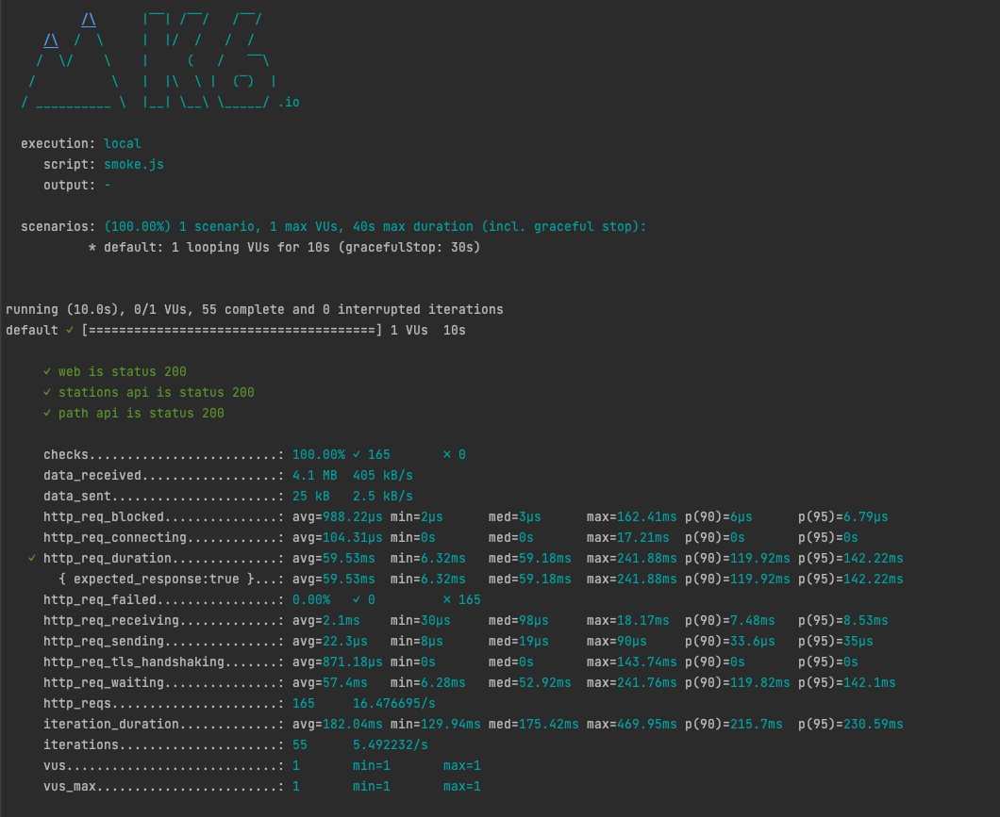
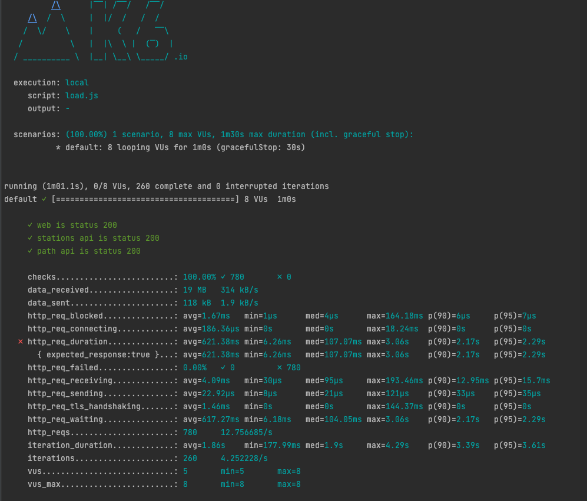
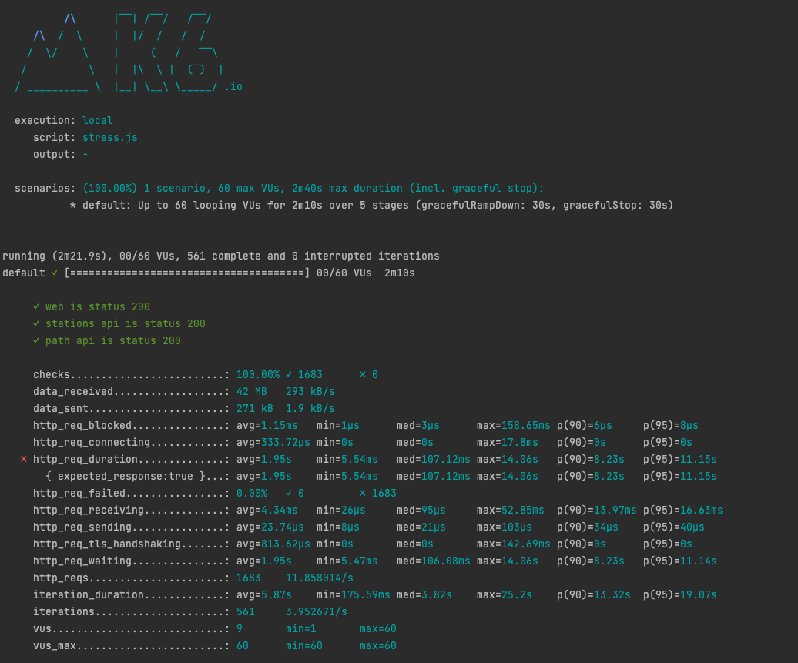
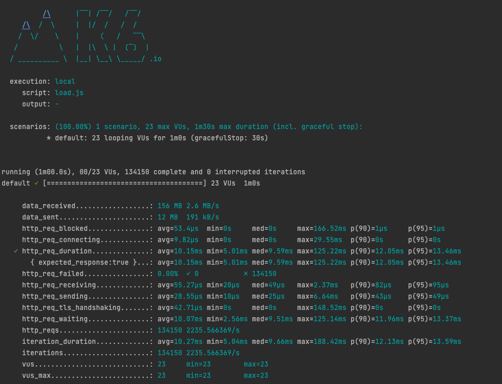
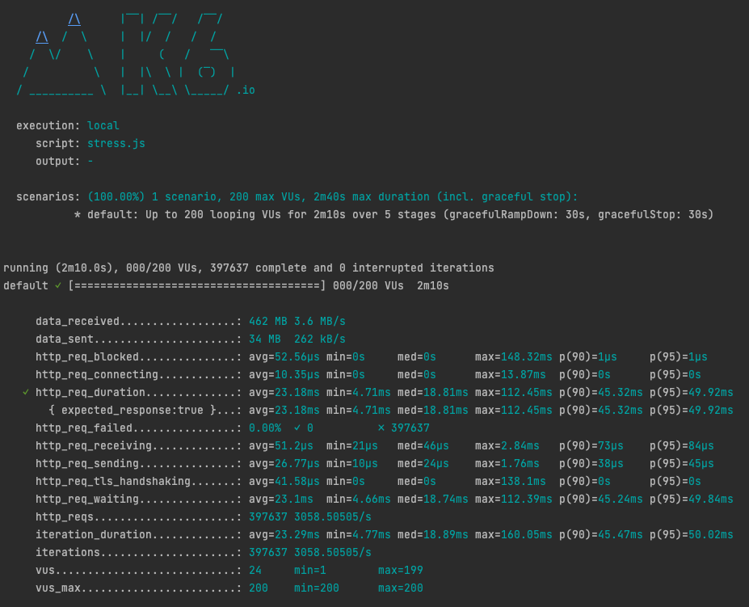
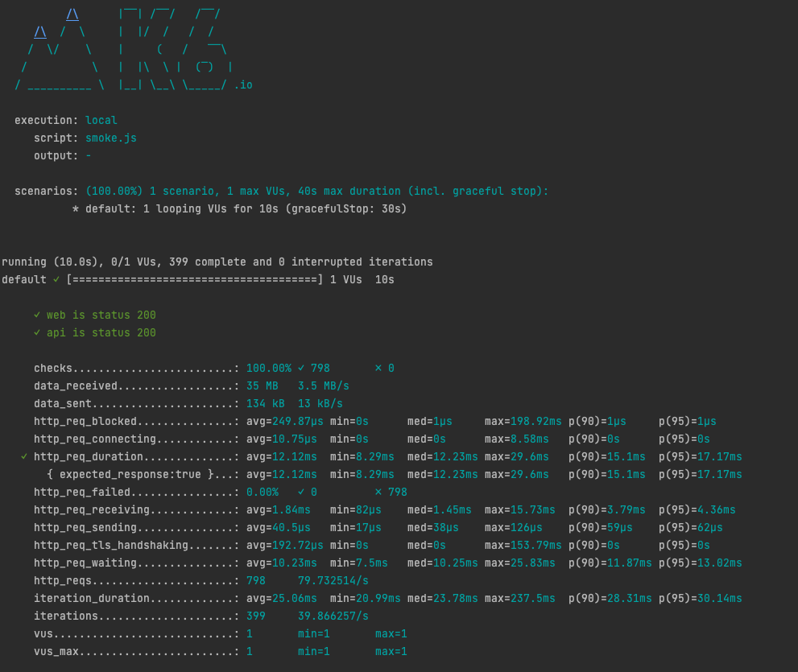
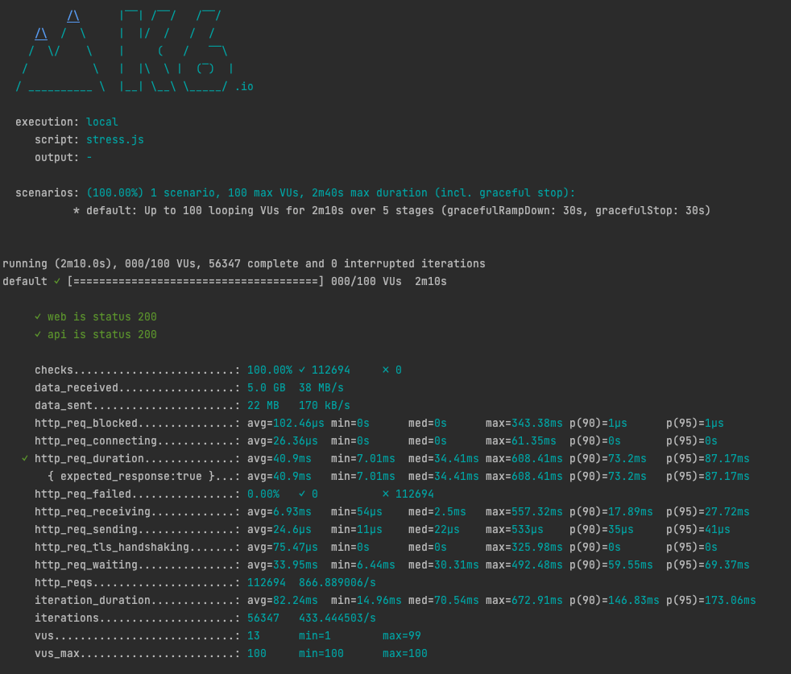

<p align="center">
    
</p>
<p align="center">
  
  
  <a href="https://edu.nextstep.camp/c/R89PYi5H" alt="nextstep atdd">
    
  </a>
  
</p>

<br>

# 인프라공방 샘플 서비스 - 지하철 노선도

<br>

## 🚀 Getting Started

### Install
#### npm 설치
```
cd frontend
npm install
```
> `frontend` 디렉토리에서 수행해야 합니다.

### Usage
#### webpack server 구동
```
npm run dev
```
#### application 구동
```
./gradlew clean build
```
<br>


### 1단계 - 성능 테스트
1. 웹 성능예산은 어느정도가 적당하다고 생각하시나요
<br>네이버 : https://m.map.naver.com/subway/subwayLine.naver?region=1000


----------
나의 서비스 : https://infra-study.p-e.kr/


사용자 체감상 1초 이내, 경쟁사 대비 20프로 이내의 성능
* fcp : 0.8초
* tti: 1초 이내
* speedIndex: 2초
* Largest Contentful Paint : 2초


2. 웹 성능예산을 바탕으로 현재 지하철 노선도 서비스는 어떤 부분을 개선하면 좋을까요 
* js파일 압축 사용 : gzip압축 
* 사용하지 않는 리소스 제거 
* keep-alive 사용
* 캐시설정

3. 부하테스트 전제조건은 어느정도로 설정하셨나요
* DAU : 100만  (추측)
* 처리량 : DAU(100만) * 2  = 200만
* 평균 rps = 200만 / 86,500  = 23
* 최대 rps = 평균 * 10 = 230
* Latency = 100ms(최대)

  
4. Smoke, Load, Stress 테스트 스크립트와 결과를 공유해주세요
<br> path를 변경해가면 3개의 시나리오를 테스트했습니다.

-------
접속 빈도가 높은 페이지 : https://infra-study.p-e.kr/

* vuser
  * R = 1
  * 231(최대rps) * 0.1(Latency) / 1(R) = 23
* 스크립트:
  * [smoke](./step1/main/smoke.js) : 시나리오 검증 테스트
  * [load](./step1/main/load.js) : 최대 rps 230을 기준으로 테스트
  * [stress](./step1/main/stress.js) : 최대 rps 2배이상을 기준으로 테스트


-------
데이터를 갱신하는 페이지 : https://infra-study.p-e.kr/lines

* vuser
  * R = 2
  * 231(최대rps) * 0.1(Latency) / 2(R) = 12
* 스크립트:
  * [smoke](./step1/lines/smoke.js) : 시나리오 검증 테스트
  * [load](./step1/lines/load.js) : 최대 rps 230을 기준으로 테스트
  * [stress](./step1/lines/stress.js) : 최대 rps 2배이상을 기준으로 테스트


-------
데이터를 조회하는데 여러 데이터를 참조하는 페이지 : https://infra-study.p-e.kr/path

* vuser
  * R = 3
  * 231(최대rps) * 0.1(Latency) / 3(R) = 8
* 스크립트:
  * [smoke](./step1/path/smoke.js) : 시나리오 검증 테스트
  * [load](./step1/path/load.js) : 최대 rps 230을 기준으로 테스트
  * [stress](./step1/path/stress.js) : 최대 rps 2배이상을 기준으로 테스트




---

### 2단계 - 화면 응답 개선하기
1. 성능 개선 결과를 공유해주세요 (Smoke, Load, Stress 테스트 결과)

#### gzip, http2 적용 성능 개선 : main 페이지 테스트 

##### smoke 테스트

개선 전


개선 후


#### load 테스트
개선 전


개선 후
  

#### stress 테스트

개선 전


개선 후


---------

#### redis 적용 성능 : lines 페이지 테스트

##### smoke 테스트

개선 전


개선 후



#### load 테스트
개선 전


개선 후


#### stress 테스트

개선 전


개선 후



2. 어떤 부분을 개선해보셨나요? 과정을 설명해주세요
* nginx gzip 적용
  * nginx 설정, js, index.html 속도 빨라짐
  
* nginx http2 적용
  * nginx 설정
  
``` 
http {

  gzip_comp_level 9;
  gzip_vary on;
  gzip_types text/plain text/css application/json application/x-javascript application/javascript text/xml application/xml application/rss+xml text/javascript image/svg+xml application/vnd.ms-fontobject application/x-font-ttf font/opentype;

  upstream app {
   least_conn; ## 현재 connections이 가장 적은 server로 reqeust를 분배
   server 192.168.0.34:8080;
    server 192.168.0.90:8080;
  }

  # Redirect all traffic to HTTPS
  server {
    listen 80;
    return 301 https://$host$request_uri;
  }

  proxy_cache_path /tmp/nginx levels=1:2 keys_zone=mycache:10m inactive=10m max_size=200M;
  proxy_cache_key "$scheme$host$request_uri $cookie_user";


  server {
    listen 443 ssl http2;
    ssl_certificate /etc/letsencrypt/live/infra-study.p-e.kr/fullchain.pem;
    ssl_certificate_key /etc/letsencrypt/live/infra-study.p-e.kr/privkey.pem;

    # Disable SSL
    ssl_protocols TLSv1 TLSv1.1 TLSv1.2;

    # 통신과정에서 사용할 암호화 알고리즘
    ssl_prefer_server_ciphers on;
    ssl_ciphers ECDH+AESGCM:ECDH+AES256:ECDH+AES128:DH+3DES:!ADH:!AECDH:!MD5;

    # Enable HSTS
    # client의 browser에게 http로 어떠한 것도 load 하지 말라고 규제합니다.
    # 이를 통해 http에서 https로 redirect 되는 request를 minimize 할 수 있습니다.
    add_header Strict-Transport-Security "max-age=31536000" always;

    # SSL sessions
    ssl_session_cache shared:SSL:10m;
    ssl_session_timeout 10m;


     # cache
     location ~* \.(?:css|js|gif|png|jpg|jpeg)$ {
            proxy_pass http://app;

            ## 캐시 설정 적용 및 헤더에 추가
            # 캐시 존을 설정 (캐시 이름)
            proxy_cache mycache;
            # X-Proxy-Cache 헤더에 HIT, MISS, BYPASS와 같은 캐시 적중 상태정보가 설정
            add_header X-Proxy-Cache $upstream_cache_status;
            # 200 302 코드는 20분간 캐싱
            proxy_cache_valid 200 302 10m;
            # 만료기간을 1 달로 설정
            expires 1M;
            # access log 를 찍지 않는다.
            access_log off;
     }

    location / {
      proxy_pass http://app;
    }
  }
}


```

* spring redis cache
  * spring line api 에 캐시 적용


* 효과: 전체 시나리오 성능 50ms 이내로 개선
---

### [추가] 로깅, 모니터링
1. 각 서버내 로깅 경로를 알려주세요

2. Cloudwatch 대시보드 URL을 알려주세요
